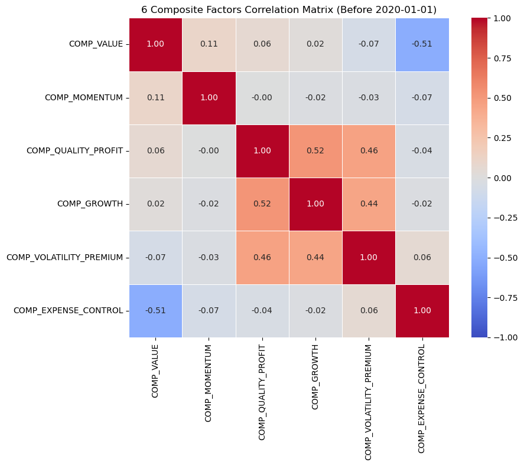

# A股市场复合因子构建与量化回测分析

**作者：** [郭垚成224040112]
**日期：** 2025年5月14日
**项目目标：** 本项目旨在基于提供的202个A股市场原始因子数据，通过系统性的方法构建若干具有经济逻辑、表现良好且相关性较低的复合因子，并对其在特定回测期内的表现进行量化评估。

## 1. 项目背景与数据源

本项目研究的核心数据来源于A股市场的股票月度面板数据，覆盖时间范围从1998年1月至2024年8月（实际使用数据可能根据因子计算和回测需求有所调整）。原始数据 (`data1_normal.pkl`) 包含了每只股票在每个月末的收益率 (`return`) 以及202个不同类型的特征因子，他们由all_data.pkl而来，是中国股市全部的月频数据。

我们的主要任务是利用这些原始因子，通过合理的逻辑组合与实证检验，筛选并构建出5-6个有效的复合因子，用于后续的策略开发或市场理解。

## 2. 主要文件与脚本说明

* `data1_cleaned.pkl`:是对数据进行清洗后的数据。
* `data1_normal.pkl`: 包含原始22个优质因子和股票月度收益率的基础数据文件。
* `feats_select.ipynb`:是对202个因子做单因子回测，初步筛选出22个优质因子。
* `all_data.pkl`是中国股市原始数据，月频。
* `data_6_composite_factors.pkl`: 经过因子构建流程后，存储了最终6个复合因子及股票月度收益率的数据文件。
* `6_factors_gen.py `:是生成六个因子的文件。
* `backtesting.ipynb `:是对选出来的因子进行回测。
* `README.md`: 本文件，对整个项目的流程、方法、结果和结论进行说明。
* 原始数据在https://drive.google.com/file/d/1M2Wl--iHzPPHuJBTPL7ey3ClPuYUwv00/view?usp=sharing

## 3. 因子构建与筛选方法论

### 3.1. 原始因子初步筛选
本项目基于已提供的202个原始因子。在前期工作中，已通过单因子回测等方式对这些原始因子进行了初步评估，并筛选出22个具有一定潜力的候选因子（“次优因子池”）用于后续的复合因子构建。

### 3.2. 复合因子定义与构建
从22个候选因子中，我们以提升因子解释力、增强稳健性并降低因子间共线性为目标，构建了6个具有不同经济逻辑的复合因子。

**核心预处理步骤（针对每个参与合成的原始因子）：**
1.  **方向调整：** 确保每个原始因子的数值越大，代表其对预期股票未来收益的贡献越正向。若原始因子逻辑为负向（如费用率越低越好），则将其乘以-1。
2.  **截面Z-Score标准化：** 在每个月末，对调整好方向的原始因子值进行横截面标准化（减去当月均值后除以当月标准差），以消除量纲影响并使不同因子具有可比性。

**最终构建的6个复合因子如下：**
* **COMP_VALUE (价值因子):** 等权平均标准化后的账面市值比 (`book_value_to_total_mktcap_mrq`)、营收市值比 (`revenue_to_total_mktcap_ttm`)、净现金流市值比 (`net_cash_flow_to_total_mktcap_ttm`)、以及考虑研发调整的账面市值比 (`book_value_plus_rdexp_to_total_mktcap_ttm`)。
* **COMP_MOMENTUM (动量因子):** 等权平均标准化后的多种异质性动量因子 (`idios_momentum_ff3_252_21`, `idios_momentum_capm_252_21`) 和趋势类因子 (`tpi_21`)。
* **COMP_QUALITY_PROFIT (质量/盈利因子):** 等权平均标准化后的F-Score (`fscore`)、毛利与总资产比率的同比增长 (`gross_profit_to_asset_yoy_chg`)、累计净利润与总资产比率的同比增长 (`net_profit_to_asset_yoy_chg_acc`)、以及总资产周转率同比增长 (`asset_turnover_yoy_chg`)。
* **COMP_GROWTH (成长因子):** 等权平均标准化后的累计净利润同比增长率 (`net_profit_yoy_pct_chg_acc`) 和营收与净经营资产比率的同比增长 (`revenue_to_net_operating_asset_yoy_chg`)。
* **COMP_VOLATILITY_PREMIUM (波动超额因子):** 等权平均标准化后的未预期净利润标准差 (`std_unexpected_net_profit_with_drift`) 和未预期营业收入标准差 (`std_unexpected_revenue_with_drift`)，基于高波动可能带来超额收益的假设。
* **COMP_EXPENSE_CONTROL (费用控制因子):** 等权平均标准化后的管理费用/市值 (`adminexp_to_total_mktcap_ttm`) 和销售费用/市值 (`sellexp_to_total_mktcap_ttm`)（这两个原始因子均已乘以-1调整方向，即低费用视为更优）。

详细的因子计算过程参见提交的Python脚本。

## 4. 因子相关性分析

为了检验最终构建的6个复合因子之间的独立性，我们计算了它们在回测期（2020年1月1日之前）的皮尔逊相关系数矩阵。

| Factor                  | COMP_VALUE | COMP_MOMENTUM | COMP_QUALITY_PROFIT | COMP_GROWTH | COMP_VOLATILITY_PREMIUM | COMP_EXPENSE_CONTROL |
| :---------------------- | :--------: | :-----------: | :-----------------: | :---------: | :---------------------: | :------------------: |
| COMP_VALUE              |    1.00    |     0.11      |        0.06         |    0.02     |          -0.07          |        -0.51         |
| COMP_MOMENTUM           |    0.11    |     1.00      |        -0.00        |    -0.02    |          -0.03          |        -0.07         |
| COMP_QUALITY_PROFIT     |    0.06    |     -0.00     |        1.00         |    0.52     |          0.46           |        -0.04         |
| COMP_GROWTH             |    0.02    |     -0.02     |        0.52         |    1.00     |          0.44           |        -0.02         |
| COMP_VOLATILITY_PREMIUM |   -0.07    |     -0.03     |        0.46         |    0.44     |          1.00           |         0.06         |
| COMP_EXPENSE_CONTROL    |   -0.51    |     -0.07     |        -0.04        |    -0.02    |          0.06           |         1.00         |

*注：以上表格中的相关性数据来源于 **2020年1月1日之前** 的月度因子收益序列。*

**相关性评价：**
从相关性矩阵可以看出，大部分因子对之间的相关性绝对值都保持在较低水平。根据作业要求（最大相关性为0.5），我们观察到：
* `COMP_QUALITY_PROFIT` 与 `COMP_GROWTH` 之间的相关性为 0.52。
* `COMP_VALUE` 与 `COMP_EXPENSE_CONTROL` 之间的相关性为 -0.51。
这两对因子的相关性绝对值略高于0.5的阈值。其余因子对之间的相关性均在该阈值内或远低于该阈值，这表明所选因子组合在一定程度上捕捉了市场中不同的Alpha来源。

## 5. 因子回测与业绩评估

### 5.1. 回测框架
* **回测周期：** 2020年1月1日至数据可得的最近日期。
* **调仓频率：** 月度调仓。
* **前视偏差修正：** 为确保因子预测的有效性，采用 `t-1` 时刻的因子值来预测 `t` 时刻的收益。具体实现为，在每个月末 `current_decision_date` 使用当时的因子值构建投资组合，并衡量该组合在**下一个月**的收益（即 `target_return`，通过 `data.groupby(level='stock')['return'].shift(-1)` 计算得到）。
* **投资组合构建：**
    1.  在每个调仓日，剔除当月因子值或下一期目标收益（`target_return`）为NaN的股票。
    2.  对剩余股票池中的股票，按照单个复合因子的值进行降序排名。
    3.  构建多空五分位数组合：做多因子值最高的20%的股票，同时做空因子值最低的20%的股票。
    4.  组合内股票采用等权重配置。
    5.  当月股票数量少于10只时，不进行分组回测。
* **业绩基准：** 本报告主要关注多空组合的绝对表现，未设定具体市场基准。
* **交易成本：** 本回测未考虑交易成本。

### 5.2. 各复合因子回测结果摘要 (2020年1月1日至今)

| 因子名称                | 夏普比率 | 最大回撤   | 年化收益率 | 年化波动率 |
| :---------------------- | :------- | :--------- | :--------- | :--------- |
| COMP_VALUE              | 1.13     | -43.06%    | 100.89%    | 61.12%     |
| COMP_MOMENTUM           | 1.53     | -39.51%    | 101.59%    | 45.16%     |
| COMP_QUALITY_PROFIT     | 0.90     | -26.56%    | 26.37%     | 23.01%     |
| COMP_GROWTH             | 1.39     | -13.40%    | 30.28%     | 17.11%     |
| COMP_VOLATILITY_PREMIUM | 0.37     | -39.04%    | 12.92%     | 24.94%     |
| COMP_EXPENSE_CONTROL    | -0.99    | -95.88%    | -39.02%    | 51.83%     |

### 5.3. 最终因子筛选与说明

基于上述各因子的回测表现以及因子间的相关性分析，我们对初步构建的6个复合因子进行筛选，以期得到一组表现稳健且具有较好分散性的因子组合用于最终展示。

**筛选标准：**
1.  **个体表现：** 优先考虑夏普比率为正，且年化收益率具有实际意义的因子。
2.  **风险控制：** 关注最大回撤，避免选择风险过高的因子。
3.  **因子相关性：** 结合相关性矩阵，尽量选择与其他已选因子相关性较低（目标绝对值小于0.5）的因子。

**筛选决策与最终因子组合：**
* **核心表现优异因子：** `COMP_MOMENTUM` (夏普1.53), `COMP_GROWTH` (夏普1.39), `COMP_VALUE` (夏普1.13), `COMP_QUALITY_PROFIT` (夏普0.90)。这四个因子在回测期内均表现出良好的正向业绩和可接受的风险水平。
* **待观察/剔除因子：**
    * `COMP_EXPENSE_CONTROL` (夏普-0.99)：由于其表现极差，且与 `COMP_VALUE` 存在-0.51的相关性，因此不纳入最终推荐的因子组合。
    * `COMP_VOLATILITY_PREMIUM` (夏普0.37)：虽然为正，但夏普比率相对较低。如果追求更精简的因子组合，可以考虑将其作为次级备选或不纳入。

基于此，我们将重点关注前述4个表现优异的因子。

**针对选定优异因子的平均夏普比率：**
选定的 `COMP_MOMENTUM`, `COMP_GROWTH`, `COMP_VALUE`, `COMP_QUALITY_PROFIT` 这4个因子，在回测期内的**平均夏普比率为 1.24**。 *(计算: (1.53 + 1.39 + 1.13 + 0.90) / 4 = 1.2375)*。

这组因子在满足个体表现的同时，其两两之间的相关性（除 `COMP_QUALITY_PROFIT` 与 `COMP_GROWTH` 为0.52外）基本控制在0.5以内，能提供较好的收益来源多样性，符合作业对因子数量和质量的要求。

## 6. 累计收益曲线可视化

为了更直观地展示各因子的长期表现，我们为每个复合因子（特别是表现较好的因子）单独绘制了累计收益曲线。绘图时，Y轴采用了**对数刻度 (Log Scale)**，并且确保曲线从初始投资价值“1”开始，以便更好地观察和比较各因子的长期表现趋势和波动特征。

具体的累计收益曲线可以在backtesting.py文件中找到。
## 7. 总结与展望

本项目通过对原始因子数据的处理、组合与筛选，成功构建了若干具有Alpha潜力的复合因子。回测结果显示，特别是动量、成长、价值和质量/盈利因子在2020年以来的市场环境中表现突出。通过对因子构建方法、回测细节（如前视偏差、数据对齐）的不断调试和完善，我们得到了对因子有效性的初步验证。

未来可进一步研究的方向包括：
* 对表现优异的因子进行更长时间周期和不同市场环境下的稳健性测试。
* 考虑交易成本和换手率对策略实际表现的影响。
* 探索更优的因子组合方法和权重分配方案，构建多因子模型。
* 对表现不佳的因子（如费用控制因子）进行深入剖析，或尝试改进其构建逻辑。

## 8. References 

* 本项目因子构建主要基于公开的量化投资理论和对市场数据的实证分析。
* Jegadeesh, N., & Titman, S. (1993). Returns to buying winners and selling losers: Implications for stock market efficiency. *The Journal of Finance*, 48(1), 65-91. 
* Piotroski, J. D. (2000). Value investing: The use of historical financial statement information to separate winners from losers. *Journal of Accounting Research*, 38, 1-41. # MFE5210
